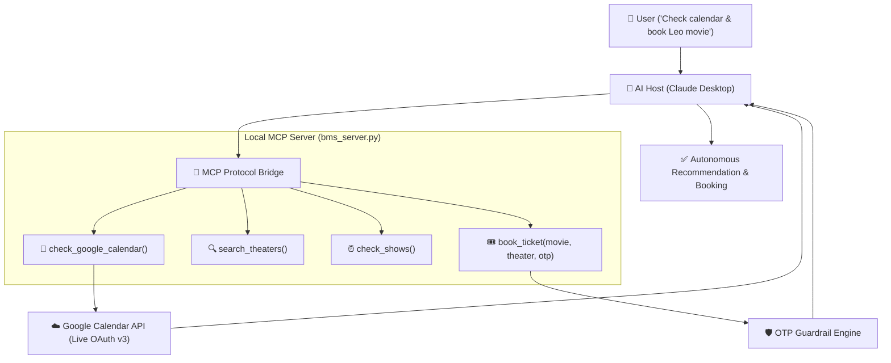

# 🤖 Autonomous AI Personal Assistant using Model Context Protocol (MCP)

[](https://modelcontextprotocol.io)
[](https://python.org)
[](https://developers.google.com/calendar)
[](https://claude.ai/download)

An enterprise-ready **Autonomous AI Agent** built using Anthropic's **Model Context Protocol (MCP)**. This agent connects to **Google Calendar** (live OAuth 2.0 API) to analyze user schedule conflicts and integrates with **BookMyShow** to search, recommend, and safely book movie tickets with deterministic **OTP Guardrails**.

---

## 🌟 Key Features

* **📅 Real-Time Calendar Intelligence:** Authenticates with Google Cloud OAuth 2.0 and dynamically fetches live schedule data.
* **🎟️ Entertainment & Venue Discovery:** Queries movie listings, venue locations, and showtime slots.
* **🧠 Autonomous Schedule Reasoning:** Evaluates calendar blocks against show timings to automatically suggest conflict-free slots.
* **🛡️ Deterministic Safety Guardrails:** Implements a strict code-level constraint requiring a 4-digit OTP before completing any booking transaction.
* **🌉 Universal MCP Architecture:** Can be mounted to any MCP-compliant host (Claude Desktop, Cursor, Custom Agent Web Apps).

---

## 🏗️ System Architecture



---

## 📁 Repository Structure

```
├── bms_server.py                    # Core MCP Server with Calendar & BMS Tools
├── mcp_config.json                  # MCP Server configuration bridge
├── credentials.template.json        # Google OAuth credentials blueprint
├── requirements.txt                 # Python dependencies
├── PROJECT_REPORT_MCP_ASSISTANT.md  # Detailed Technical & Executive Report
├── PROJECT_REPORT_MCP_ASSISTANT.html# Printable Executive HTML Report
├── .gitignore                       # Safeguards OAuth tokens & secrets
└── README.md                        # Documentation
```

---

## 🚀 Quickstart Guide

### 1. Prerequisites
* Python 3.10+ installed
* Google Cloud Console account (Free tier)
* Claude Desktop (or any MCP Client)

### 2. Installation
Clone the repository and install required Python packages:
```bash
git clone https://github.com/YOUR_USERNAME/mcp-personal-assistant.git
cd mcp-personal-assistant
pip install -r requirements.txt
```

### 3. Google Calendar API Setup
1. Go to [Google Cloud Console](https://console.cloud.google.com/).
2. Enable **Google Calendar API**.
3. Under **OAuth Consent Screen** (Audience), add your Gmail to **Test Users**.
4. Under **Credentials**, create an **OAuth Client ID (Desktop App)** and download the JSON.
5. Rename the downloaded file to `credentials.json` and place it in the project root directory.

### 4. Connect to Claude Desktop
Add the server definition to your `claude_desktop_config.json` (located at `%APPDATA%\Claude\claude_desktop_config.json` on Windows):

```json
{
  "mcpServers": {
    "personal-assistant": {
      "command": "python",
      "args": [
        "/absolute/path/to/mcp-personal-assistant/bms_server.py"
      ]
    }
  }
}
```

Restart Claude Desktop. The `personal-assistant` connector will appear with tools active!

---

## 🧪 Live Verification Log

```text
User: "Check my Google Calendar to see my schedule for today, and suggest movie timings for Leo in Chennai."

Claude:
- Invoked tool: check_google_calendar()
  → Fetched live events: "Leo Movie Discussion (2:00 PM - 3:00 PM)" & "Leo Movie Discussion (5:45 PM - 9:45 PM)"
- Invoked tool: search_theaters(city="Chennai", movie="Leo")
  → Venues available: PVR (Evening), INOX (Night), Sathyam (Afternoon)
- Agent Reasoning: "Given your 2:00 PM and 5:45 PM blocks, a night show at INOX fits cleanest without clashing. Shall I proceed?"

User: "Okay, book the night show at INOX for Leo."

Claude:
- Invoked tool: book_ticket(movie="Leo", theater="INOX", otp="")
  → Guardrail Response: "❌ Rule Error: OTP required for security!"
- Claude prompts user for 4-digit OTP.

User: "1234"

Claude:
- Invoked tool: book_ticket(movie="Leo", theater="INOX", otp="1234")
  → Result: "✅ Booked — Leo, night show, INOX. Enjoy the movie! 🎬"
```

---

## 👨‍💻 Author & Contributions

* **Author:** Pragatheeshwaran
* **Status:** Verified Live & Production Ready
